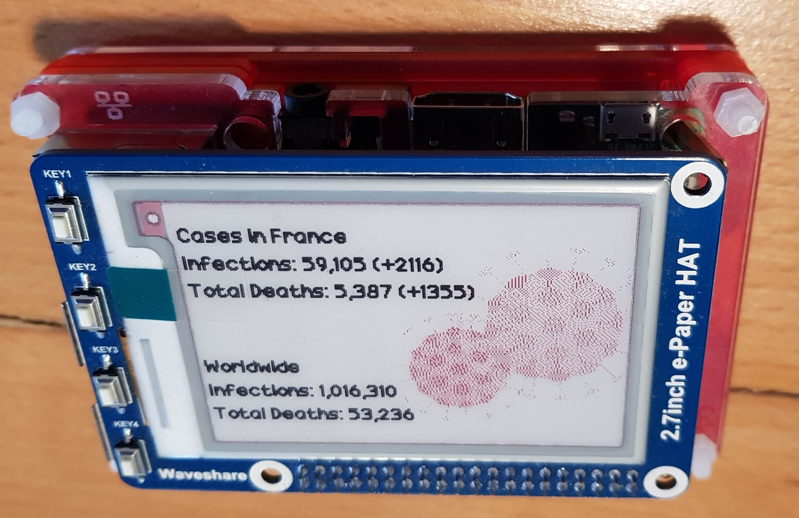

# rpi-covid
Covid case counter for raspberry pi and an e-ink display.

### Materials
- Wifi-capable raspberry pi 
- Red/Black e-ink display. [Source](https://www.waveshare.com/wiki/2.7inch_e-Paper_HAT_(B))

### Requirements
- Python 3
- BeautifulSoup
- PIL
- Requests

Final result:

  
